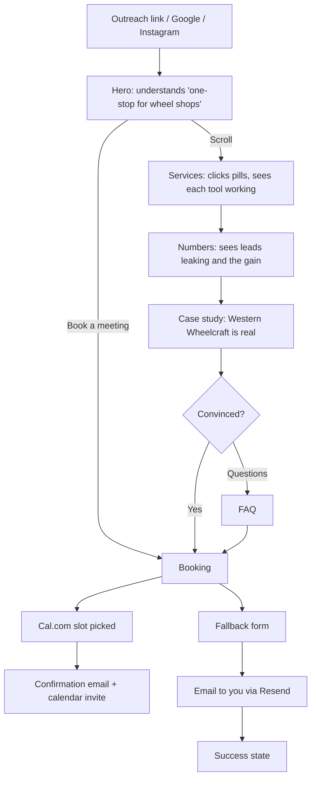
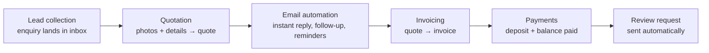
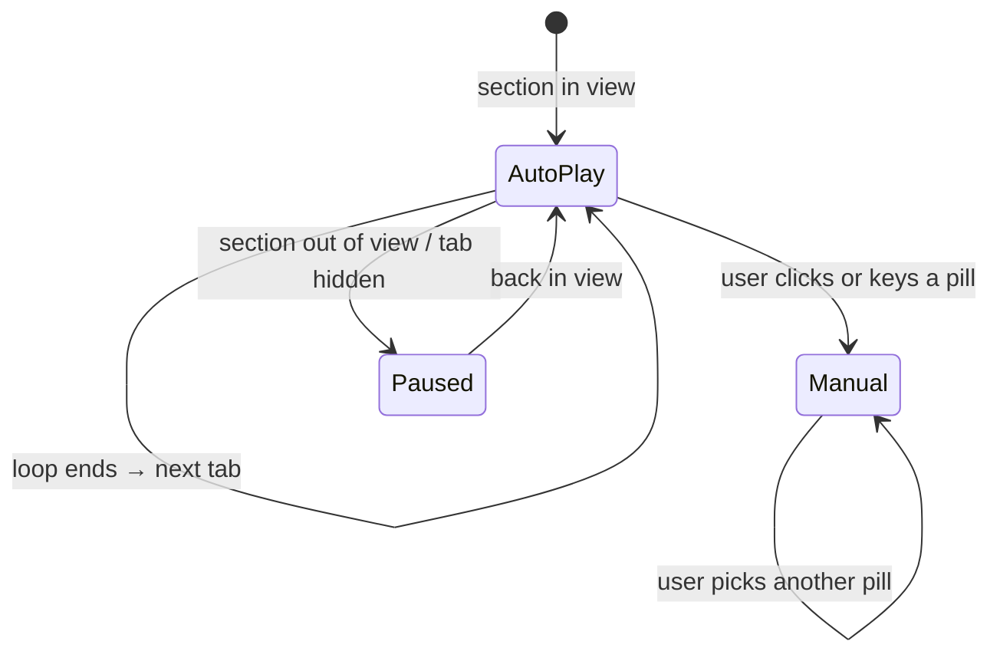
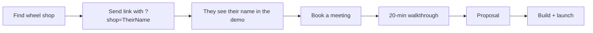

# WheelPro Systems — Build Plan

Version 1.0 · 2026-10-03 · Companion files: [REQUIREMENTS.md](REQUIREMENTS.md) · [DESIGN-SYSTEM.md](DESIGN-SYSTEM.md)

**Status: plan only. Nothing gets built until you approve.**

---

## 1. Page map

```
┌─────────────────────────────────────────────┐
│ NAV  WheelPro · Services Results Case FAQ · [Book a meeting]
├─────────────────────────────────────────────┤
│ 1. HERO        One-stop solution for wheel refinishing businesses
│                [Book a meeting]  See how it works
│                ◄◄ drifting strip of system cards ◄◄
├─────────────────────────────────────────────┤
│ 2. SERVICES    [Lead] [Quote] [Email] [Invoice] [Payment]   ← sticky pills
│                ┌───────────────────────────────┐
│                │ text  │   animated visual     │
│                └───────────────────────────────┘
├─────────────────────────────────────────────┤
│ 3. NUMBERS     (dark rounded panel)
│                10 → 4 lost → 3 paid  vs  10 → 6 paid
│                bar chart: Today vs With WheelPro
├─────────────────────────────────────────────┤
│ 4. CASE STUDY  Western Wheelcraft · pills · result badge · big screenshot
├─────────────────────────────────────────────┤
│ 5. FAQ         accordion, 5 questions
├─────────────────────────────────────────────┤
│ 6. BOOK        headline · 3-point agenda · calendar embed / form
├─────────────────────────────────────────────┤
│ FOOTER
└─────────────────────────────────────────────┘
```

---

## 2. Section-by-section spec

### 2.0 Navigation
- Layout and behaviour as in DESIGN-SYSTEM §6.9.
- The links smooth-scroll to section anchors, and the active link gets a 1px underline as its section scrolls through.

### 2.1 Hero

**Copy**
- Label: `BUILT ONLY FOR WHEEL REFINISHERS`
- Headline (display, centred, 2 lines): **One-stop solution for wheel refinishing businesses.**
- Subline (body-lg, 46ch): *Leads, quotes, follow-ups, invoices and payments, all in one place. Less time on the phone, more wheels in the bay.*
  - With `?shop=Ace%20Wheels`: *"Ace Wheels: leads, quotes, follow-ups, invoices and payments, all in one place."*
- Buttons: **Primary arrow pill "Book a meeting"** + ghost link "See how it works ↓".
- Under the buttons: small proof line in `--ink-3`: "Running now at Western Wheelcraft, BC."

**Layout**
- Desktop: centred text block, about 160px from the top; the strip starts 96px below the buttons and runs the full width of the screen.
- Mobile: left-aligned text, buttons stacked full width, strip below.

**Drifting strip (the hero visual)**
Seven rounded cards (r 24px, 360×260 desktop / 260×190 mobile), each a static snapshot of the system:

| # | Card | Shows |
|---|---|---|
| 1 | Lead inbox | 4 enquiries with source icons (Website, Google, Instagram, Facebook) |
| 2 | Quote request | Wheel photo + "4 × 20″ · Curb rash · Satin Bronze" |
| 3 | Auto email | "Got your photos — quote within 2 hours" |
| 4 | Quote | Line items + "Approve quote" button |
| 5 | Invoice | INV-0412, Sent status chip |
| 6 | Payment | "$150 deposit received", Paid chip |
| 7 | Job board | Five columns with job cards |

**Motion:** headline word reveal (60ms stagger) → subline and buttons fade up (+200ms) → the strip fades in (+400ms) and starts drifting left at 30px/s. Pauses on hover; edges fade out.

### 2.2 Services: pill bar + visual module

**Copy**
- Label: `SERVICES`
- Headline: **Five tools. One system.**
- Subline: *Click through a real job, from first message to money in the bank.*

**Pills (in job order):** Lead collection · Quotation · Email automation · Invoicing · Payments

**Behaviour**
- The pill bar is sticky (top: 88px) while the section is on screen.
- **Auto-play:** each tab plays its loop (about 6s), the progress line fills, then it moves to the next. It loops until the user clicks.
- **On click:** the black pill slides over, the stage cross-fades, and auto-play stops for good.
- Every visual uses **the same sample job**: *Sample: Jordan M. · 2021 BMW X5 · 4 × 20″ · Curb rash on 2 · Satin Bronze · Mobile, Surrey*. Visitors watch one customer move through the system.

**Stage layout (desktop):** left 4 columns of text, right 8 columns of the animated mock. **Mobile:** pills scroll horizontally with snap; the stage stacks the mock first, then the text.

#### Visual storyboards (each loop is about 6s, then holds 1s)

**① Lead collection: "Every enquiry. One inbox."**
| Time | Action |
|---|---|
| 0.0s | Empty inbox panel titled "New enquiries" |
| 0.4s | Card slides in: *Instagram DM, "how much to fix my rims?"* |
| 1.2s | Card: *Website form, Jordan M., 4 photos* |
| 2.0s | Card: *Google Business, call-back request* |
| 2.8s | Card: *Facebook, "do you do bronze?"* |
| 3.8s | All four collapse into one list with source icons; counter "4 new today" counts up |
| 5.0s | Jordan's card is highlighted with the "Ready to quote" chip |
- Text bullets: Website, Google, Instagram and Facebook in one place · Nothing slips through texts · Every lead saved with contact details.

**② Quotation: "Every request arrives ready to price."**
| Time | Action |
|---|---|
| 0.0s | Phone-shaped quote form (shop name from `?shop=`) |
| 0.5s | 2 wheel photos drop into the photo slots |
| 1.4s | Fields fill one by one: Size 20″ · Wheels 4 · Damage: Curb rash ×2 · Finish: Satin Bronze swatch · Mobile, V3S |
| 3.4s | "Send for quote" button pressed (scales to 0.98) |
| 4.0s | Owner view slides in from the right: the request card with "Quote" button → line items appear → "Quote sent ✓" chip |
- Bullets: Photos, size, damage and finish in one request · Your own finish chart with swatches · Send a quote in one tap.

**③ Email automation: "Follow-ups that send themselves."**
| Time | Action |
|---|---|
| 0.0s | Vertical timeline with 4 nodes |
| 0.4s | Node 1 lights up: *Instant: "Got your photos, quote within 2 hours"* (Sent chip) |
| 1.6s | Node 2: *+1 day: "Did you see your quote?"* |
| 2.8s | Node 3: *−1 day: "See you Thursday at 9:00"* |
| 4.0s | Node 4: *+2 days after job: "How did we do? Leave a review"* |
| 5.0s | A small envelope icon travels down the line; all chips show Sent |
- Bullets: Instant reply, day and night · Quote follow-ups win back quiet customers · Reminders cut no-shows; review requests grow your Google rating.

**④ Invoicing: "Quote approved. Invoice ready."**
| Time | Action |
|---|---|
| 0.0s | The approved quote card (from ②) |
| 0.6s | The card morphs into an invoice layout (INV-0412): the same line items slide into place, with tax lines added |
| 2.4s | Totals count up (mono numbers) |
| 3.4s | "Send invoice" pressed → Sent chip → a mini phone preview shows the email with a "Pay now" button |
- Bullets: Made from the quote, no retyping · Tax and your branding included · Sent by email with a pay button.

**⑤ Payments: "Deposits and balances, paid by card."**
| Time | Action |
|---|---|
| 0.0s | Payment screen: "Deposit due today $150.00" |
| 0.6s | Card number types in (4242 test pattern, shown as •••• 4242) |
| 1.8s | "Pay" pressed → spinner 0.6s |
| 2.6s | Success: green check draws in, "Deposit received" |
| 3.6s | Job board inset: Jordan's card slides from **Quoted** to **Paid** (status chip turns green) |
| 4.6s | Payout line: "$150.00 → your bank account" |
- Bullets: Deposits on approval stop no-shows · Card payments straight to your account · Paid status on every job.

> All prices in the visuals are sample figures, labelled "Sample."

### 2.3 Numbers story: the big picture

**Container:** a dark rounded panel (`--dark`, r 32px, inset 24px from the screen edges, like the reference's black block). It's the only dark section.

**Copy, shown one line at a time as you scroll (each line sticky for about 60vh):**

| Step | Big number (stat) | Line (h2, white) | Small line (on-dark-2) |
|---|---|---|---|
| 1 | **10** | people ask you for a quote this week. | Texts, calls, DMs, your website. |
| 2 | **4** | book another shop before you reply. | You were in the bay. They weren't waiting. |
| 3 | **2** | go quiet after your quote. | Nobody followed up. |
| 4 | **1** | doesn't show up. | No deposit, no commitment. |
| 5 | **3** | paid jobs. From 10 leads. | That's normal. That's the leak. |
| 6 | **6** | paid jobs with WheelPro. Same 10 leads. | Instant reply. Automatic follow-up. Deposit on booking. |
| 7 | **+$1,800** | more every week. | 3 extra jobs × $600 average job. Example figures. |

- Numbers 2–4 show in `--warn` with a small "lost" marker; numbers 6–7 show in `--accent`.
- Each number counts up as its line enters; the previous line fades to 20% opacity.

**Chart (closes the section, all steps visible together):**
A horizontal grouped bar chart, "Where the 10 leads go":

| Stage | Today | With WheelPro |
|---|---|---|
| Asked for a quote | 10 | 10 |
| Got a reply in time | 6 | 10 |
| Still interested after quote | 4 | 8 |
| Booked | 4 | 7 |
| Showed up and paid | **3** | **6** |

- Bars: Today in `--dark-line` grey with white value labels; With WheelPro in `--accent`.
- They grow left to right in stage order (120ms stagger, 1200ms each) when the chart scrolls in.
- Below: caption "Example based on a shop getting 10 quote requests a week. Your numbers will differ." plus a ghost link "Work out your own numbers in the meeting →".
- Accessibility: the chart is an HTML `<table>` styled as bars, so screen readers get the data.
- *(Optional v1.1)* Two sliders, "Quote requests per week" and "Average job $", recalculate steps 5–7 and the chart live.

**Mobile:** the steps stack (no sticky), each number about 72px; the chart switches to stacked pairs per stage.

### 2.4 Case study: Western Wheelcraft

**Layout (as in the reference):** left 4 columns, right 8 columns with a large framed screenshot.

- Client line: `WESTERN WHEELCRAFT` + tag `WHEEL REPAIR · BC`
- Title (h2): **Mobile and shop wheel refinishing across BC.**
- Result badge: **[real number needed, e.g. "Quotes answered in under 5 min"]**
- Short story, three lines:
  - **Before:** *[from the client: e.g. quotes by text, no online booking]*
  - **What we built:** Website, photo quotation, booking and email follow-up.
  - **Now:** *[real result]*
- Owner quote: *"[1–2 sentences from the owner]"*, attributed by name and role.
- Pills: WEBSITE · QUOTATION · EMAIL AUTOMATION · BOOKING
- Buttons: Primary arrow pill "Visit their site" (opens a new tab).
- Right: the 2× screenshot in a screenshot frame with slight parallax (−40px).
- Below the frame: three facts in a row (mono labels): **Shop:** Burnaby · **Mobile:** Vancouver Island, Interior · **Customers:** dealers, fleets, owners.

> Until the real quote and numbers arrive, this section ships with facts only. No invented results.

### 2.5 FAQ (accordion)
1. **How long until I'm live?** *[e.g. 2–3 weeks: confirm]*
2. **Do I own my website and customer data?** *[confirm: yes]*
3. **Can I keep my domain and phone number?** Yes.
4. **Which payment providers?** *[Stripe / Square: confirm]*
5. **What does it cost?** *[starting price, or "Depends on what you need; we'll quote in the meeting"]*

### 2.6 Book a meeting
- Label `GET STARTED`; headline **Let's set up your shop.**
- Subline: *20 minutes. We'll show you the system with your services, your area and your finishes.*
- Agenda list (3 rows, mono time labels): `5 min` How you get jobs today · `10 min` Live walkthrough · `5 min` What we'd set up first.
- Right side: **Cal.com inline embed** (20-min event). Below it: "Prefer we contact you?", which opens the fallback form (name, shop or mobile, email, phone, "biggest headache" select). The form is described in DESIGN-SYSTEM §6.7.
- Success state: green check, "Booked. Check your email for the calendar invite."

### 2.7 Footer
- Wordmark · "Built only for wheel refinishers" · email · © 2026 · "Sample data on this page is illustrative."

---

## 3. Flows

### 3.1 Visitor flow (what the page is designed for)



### 3.2 The story the services section tells (one job, five tools)



### 3.3 Service pill interaction



### 3.4 Your outreach flow (how the page gets used)



---

## 4. Motion map (per section)

| Section | Entrance | Ongoing | Interaction |
|---|---|---|---|
| Nav | Fade in 400ms | Blur and border appear after 8px of scroll | Link underline slides 240ms |
| Hero | Word reveal → fade-ups → strip fades in | Strip drifts at 30px/s | Strip pauses on hover; button arrow nudges |
| Services | Headline fade-up; pill bar slides up 24px | Auto-play loops + progress line | Shared pill slider (spring); stage cross-fade 600ms |
| Numbers | Panel scales from 0.96 → 1 with radius 48 → 32 as it enters | Sticky lines, count-ups per step | Bars grow on view |
| Case study | Text stagger fade-ups | Screenshot parallax −40px | Frame lifts with `--shadow-lg` on hover; image scales to 1.02 |
| FAQ | Rows fade up, 60ms stagger | — | Height animation 400ms; + rotates to × |
| Book | Fade-up | — | Field focus rings; button loading → success morph |

**Rule:** one main motion idea per section. If two things move at once, one of them is wrong.

---

## 5. Charts and data visuals (summary)

| Visual | Where | Type | Data | Notes |
|---|---|---|---|---|
| Lead counter | Service ① | Count-up number | 0 → 4 | Mono, tabular |
| Quote totals | Service ②④ | Count-up currency | Sample prices | Labelled Sample |
| Email timeline | Service ③ | Vertical step line | 4 nodes | Line draws with `stroke-dashoffset` |
| Job board | Hero card 7, Service ⑤ | Kanban mini | 5 columns | Card moves Quoted → Paid |
| Leak story | Numbers | Big stats | 10 / 4 / 2 / 1 / 3 / 6 / +$1,800 | Warn colour for losses, accent for gains |
| Lead funnel | Numbers (end) | Horizontal grouped bars | Table in §2.3 | HTML table, accessible |

---

## 6. Responsive behaviour

| Element | Desktop ≥1024 | Tablet 768–1023 | Mobile <768 |
|---|---|---|---|
| Hero text | Centred, display 88px | Centred, 64px | Left, 44px, buttons full width |
| Strip cards | 360×260 | 300×220 | 260×190 |
| Service pills | Centred track | Centred, may wrap scroll | Horizontal scroll, snap, fade at edges |
| Stage | Text left / mock right | Mock top / text below | Same as tablet; mock 4:5 |
| Numbers | Sticky step sequence | Sticky | Stacked steps, no sticky |
| Chart | Grouped bars side by side | Same | Stacked pairs per stage |
| Case study | 4/8 split | Stacked | Stacked; facts wrap to 1 column |
| Booking | Copy left / embed right | Stacked | Stacked; embed full width |

---

## 7. File structure (Next.js)

```
app/
  layout.tsx            fonts, metadata, Lenis provider, analytics
  page.tsx              composes sections
  api/contact/route.ts  fallback form → Resend
components/
  nav.tsx
  hero/ hero.tsx, card-strip.tsx, strip-cards/*.tsx
  services/ services.tsx, pill-bar.tsx, stage.tsx,
            visuals/ lead-inbox.tsx, quote-form.tsx, email-timeline.tsx,
                     invoice.tsx, payment.tsx
  numbers/ numbers.tsx, story-step.tsx, funnel-chart.tsx
  case-study.tsx
  faq.tsx
  book/ book.tsx, cal-embed.tsx, contact-form.tsx
  ui/ button.tsx, pill.tsx, tag.tsx, badge.tsx, status-chip.tsx,
      accordion.tsx, field.tsx, reveal.tsx, count-up.tsx
lib/
  sample-job.ts         the shared Jordan M. job data
  shop-param.ts         reads ?shop= safely (max 40 chars, text only)
  tokens.css            design tokens from DESIGN-SYSTEM.md
public/
  western-wheelcraft@2x.webp, wheels/*.webp, og.png
```

---

## 8. Build phases

| Phase | Work | Output | Est. |
|---|---|---|---|
| 0 | You approve this plan; send the content in REQUIREMENTS §9 | Go-ahead | — |
| 1 | Project setup, tokens, fonts, UI primitives (buttons, pills, chips, fields) | Component sheet page | 0.5 day |
| 2 | Nav + Hero + drifting strip | First viewport done | 1 day |
| 3 | Services: pill bar, stage, 5 animated visuals | Core section done | 2 days |
| 4 | Numbers story + funnel chart | Section done | 1 day |
| 5 | Case study, FAQ, Booking (Cal.com + Resend), footer | Page complete | 1 day |
| 6 | Responsive pass, reduced motion, a11y, performance, SEO | Lighthouse ≥ 95 | 0.5 day |
| 7 | Review on desktop + phone, fixes, deploy to Vercel preview | Preview link | 0.5 day |
| 8 | Your feedback round → production deploy on your domain | Live | 0.5 day |

---

## 9. QA checklist (before launch)

- [ ] Every pill works by mouse, touch and keyboard; auto-play stops after a click.
- [ ] All visuals loop cleanly with no jumps; "Sample" tags are visible.
- [ ] Count-ups finish on the correct values; the chart matches the table.
- [ ] `?shop=` with odd input (emoji, long text, HTML) is escaped and truncated safely.
- [ ] Booking completes on iPhone Safari and Android Chrome.
- [ ] Form errors show and clear; the success state appears; the email arrives.
- [ ] Reduced motion: all content is visible and nothing moves.
- [ ] No horizontal scroll at 360px.
- [ ] Contrast passes; focus rings are visible everywhere.
- [ ] LCP < 2.0s, CLS < 0.05 on mobile.
- [ ] No invented numbers, quotes or client names anywhere.

---

## 10. Open decisions for you

1. **Tab order:** job order (Lead first, recommended) or Quotation first?
2. **Accent colour:** electric blue `#2F5BFF` (recommended, close to the reference's blue), or a wheel tone such as bronze?
3. **Numbers story sample:** keep $600 average job and 10 leads/week, or give me your own?
4. **Calculator sliders** in the numbers section: in v1 or later?
5. **Booking:** Cal.com or Calendly?
6. **Font:** Geist (recommended) or Inter Display?
